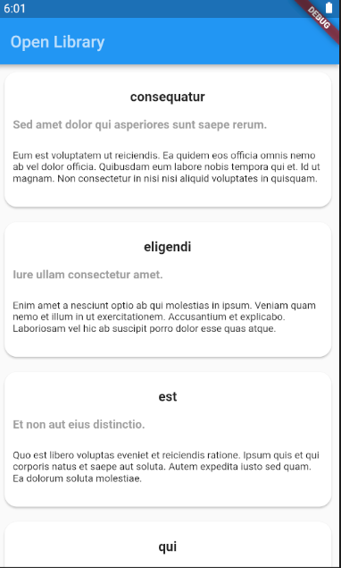
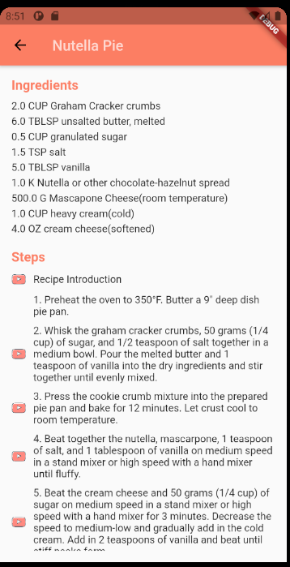
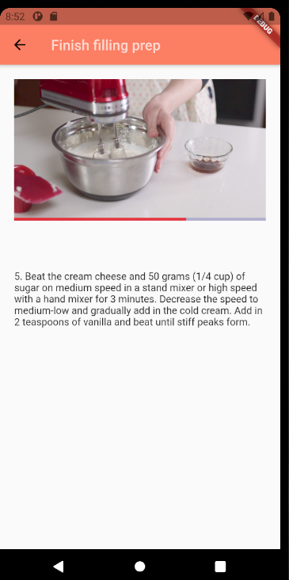

# Cooking

Simple app to help me to consolidate everything I've learned and apply some concepts I've already used on Android. 
 
 

[*Architecture*](https://github.com/ResoCoder/flutter-tdd-clean-architecture-course)
 
 
 

App Libraries 
 
In this Project i have used many api which and I will describe each one briefly.

**get_it**: Dependencies Injection library  
**flutter_bloc**: Library that helps implement the [BLoC design pattern](https://www.didierboelens.com/2018/08/reactive-programming-streams-bloc/).  
**shimmer**: Library that provides an easy way to add a shimmer effect to any view.  
**mockito**: Mockito is a mocking framework to help us to create a clean unity test.  
**bloc_test**: A testing library which makes it easy to test blocs.  
  
 
 
 

 

 

## Getting Started

For those who want to get started, I recommend these two free courses on Udemy 

https://www.udemy.com/course/flutter-crie-aplicativos-android-e-ios-com-sdk-mobile-do-google-e-dart/

https://www.udemy.com/course/flutter-desenvolva-um-cadastro-completo-2020/

I also recommend this series of videos that cover best practices like TDD and Clean Architecture.

https://www.youtube.com/playlist?list=PLB6lc7nQ1n4iYGE_khpXRdJkJEp9WOech

This project is a starting point for a Flutter application.

A few resources to get you started if this is your first Flutter project:

- [Lab: Write your first Flutter app](https://flutter.dev/docs/get-started/codelab)
- [Cookbook: Useful Flutter samples](https://flutter.dev/docs/cookbook)

For help getting started with Flutter, view our
[online documentation](https://flutter.dev/docs), which offers tutorials,
samples, guidance on mobile development, and a full API reference.
